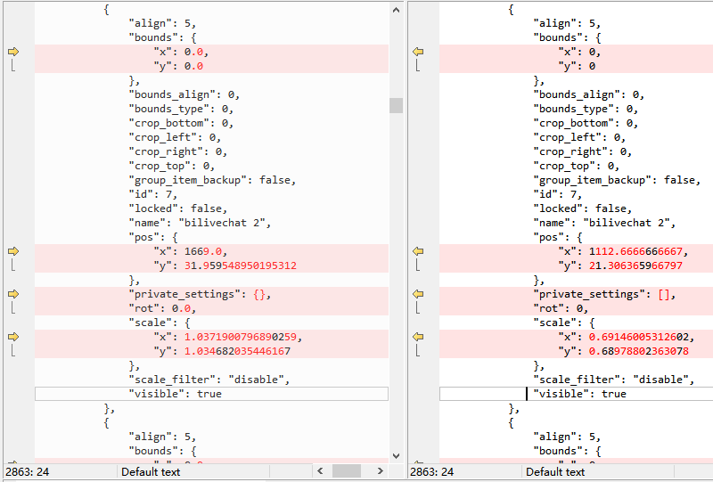

# obs-scene-canvas-scale-change-php

Just a php script to let you change canvas scale on the fly.

It just changes the items' *pos* and *scale*, divided by 1.5 or something.

Read and understand the code before using.

Use at Your Own Risk. Remember to make backup when messing with your scene config.
